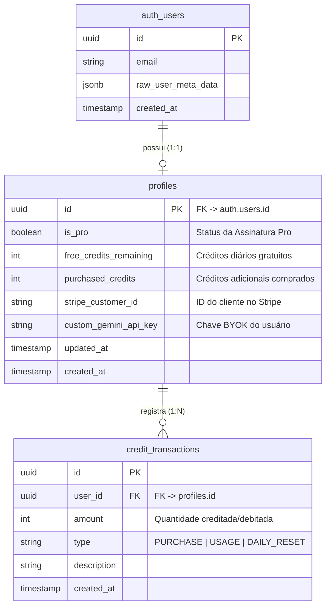
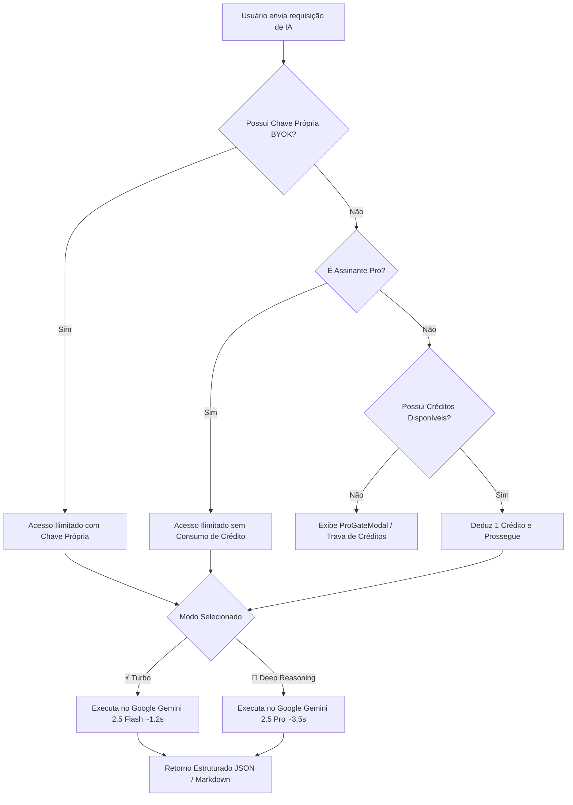

# 📐 DevKit (dev-kit.tech) — Arquitetura Técnica & Especificação Completa

Este documento fornece um panorama técnico detalhado da arquitetura, funcionalidades, stack tecnológico, banco de dados, fluxo de autenticação, inteligência artificial e monetização da plataforma **DevKit** (`dev-kit.tech`).

---

## 1. 🏗️ Visão Geral & Filosofia de Engenharia

O **DevKit** é uma suíte unificada de ferramentas de produtividade para engenheiros de software, arquitetada com três pilares centrais:
1. **Client-First & Privacidade Estrita (Zero-Server Storage):** Ferramentas offline (conversores, geradores de hash, decodificadores JWT, etc.) são processadas 100% no navegador do usuário utilizando Web Workers, Web Crypto API e manipulação de memória local. Nenhum dado sensível (JSON, credenciais, payloads) é enviado ou persistido em servidores para ferramentas locais.
2. **Alta Performance & Zero Latência:** Desenvolvido em **Next.js 15.5 (App Router)** com React 19, otimizado para notas 90+ no Google PageSpeed Insights via fontes locais inlined (`next/font`), renderização sob demanda e carregamento não-bloqueante de scripts.
3. **Inteligência Artificial Híbrida (Turbo vs. Deep Reasoning):** Ferramentas com IA utilizam modelos Google Gemini com roteamento dinâmico entre `gemini-2.5-flash` (~1.2s) para tarefas ágeis e `gemini-2.5-pro` (~3.5s) para auditorias complexas de código e arquitetura.

---

## 2. 💻 Stack Tecnológico

| Camada | Tecnologia / Biblioteca | Finalidade |
| :--- | :--- | :--- |
| **Framework Web** | `Next.js 15.5.23 (App Router)` | Roteamento dinâmico, Server Components e API Routes |
| **Linguagem** | `TypeScript 5.x (Strict Mode)` | Tipagem estrita de payloads, schemas e componentes |
| **Biblioteca de UI** | `React 19` | Componentização moderna e hooks reativos |
| **Estilização** | `Tailwind CSS v4 + Vanilla CSS` | Sistema de design moderno, glassmorphism e tema escuro |
| **Componentes Base** | `Radix UI` + `Lucide React` | Primitivas acessíveis (Diálogos, Tooltips, Dropdowns) e ícones |
| **Notificações** | `Sonner` | Sistema de toasts reativos e contextuais |
| **IA / LLM Engine** | `@google/genai` (Gemini SDK) | Integração oficial com Google Gemini 2.5 Flash & Pro |
| **BaaS / Banco de Dados** | `Supabase` (PostgreSQL + Auth) | Autenticação, perfis de usuários e controle de créditos |
| **Pagamentos / Billing** | `Stripe SDK` (`stripe-node`) | Assinaturas recorrentes, Checkout Sessions e Webhooks |
| **Monetização / Ads** | `Google AdSense` | Anúncios com supressão automática inteligente para membros Pro |
| **Linter & Testes** | `Oxlint` + `Vitest` | Validação ultrarrápida de código e testes unitários |

---

## 3. 🗄️ Banco de Dados & Modelagem de Dados (Supabase PostgreSQL)

A persistência do sistema é gerenciada via **Supabase PostgreSQL**. O schema é otimizado para gerenciar a identidade do desenvolvedor, permissões do plano Pro e consumo de créditos de IA.

### Regras de Segurança (Row Level Security - RLS):
- Usuários autenticados só podem consultar e atualizar o próprio registro na tabela `profiles`.
- Apenas a Service Role Key (usada nas rotas de webhook do Stripe e API Routes seguras) pode atualizar o campo `is_pro` e `purchased_credits`.

---

## 4. 🔐 Autenticação & Gestão de Sessões

A autenticação é construída sobre `@supabase/ssr`, garantindo conformidade com o modelo de Server Components e Cookies seguros do Next.js:

1. **Métodos Suportados:**
   - **GitHub OAuth:** Login direto em 1 clique para desenvolvedores (Callback URL: `/auth/callback`).
   - **Email / Senha ou Magic Link:** Autenticação tradicional via Supabase Auth.
2. **Middleware de Sessão (`src/middleware.ts`):**
   - Atualiza tokens JWT e cookies de autenticação em cada requisição de forma transparente.
3. **Modo Híbrido (Usuário Deslogado vs. Logado):**
   - Usuários não-autenticados possuem um sistema local de créditos no `localStorage`.
   - Ao fazer login, a função `syncUserCreditsWithCloud()` sincroniza os créditos e o status Pro locais com a nuvem no Supabase.

---

## 5. 🤖 Motor de Inteligência Artificial & Roteamento Dinâmico

O backend de IA (`/api/ai/*`) foi desenvolvido com base no SDK oficial da Google (`@google/genai`) e conta com roteamento adaptativo:

### Políticas de Modelos por Ferramenta:
- **`gemini-2.5-flash`:** Utilizado para tarefas de alta velocidade:
  - AI Regex Studio
  - AI Git Commit & PR Generator
  - AI SQL Query Generator
  - AI Documentation Generator
- **`gemini-2.5-pro` (Flagship Reasoning):** Roteado no modo **Deep** para tarefas arquiteturais complexas:
  - AI Code Modernizer & Refactor (AST & SOLID)
  - AI Unit Test & Mock Generator (Cobertura exaustiva)
  - AI Code & Security Vulnerability Analyzer (Auditoria OWASP)
  - AI Database Schema Mapper (Prisma, Drizzle, TypeORM, Zod)
  - AI Code Generator & Architect

---

## 6. 💳 Monetização & Sistema Pro

O modelo de negócios é freemium e sustentável:

### A. Plano Gratuito (Free Tier):
- Acesso ilimitado a todas as ferramentas 100% client-side.
- Cota diária de 5 gerações com IA no modo Turbo (`gemini-2.5-flash`).
- Opção **BYOK (Bring Your Own Key)** gratuita: basta o usuário inserir sua chave da Google AI Studio para ter IA ilimitada sem pagar nada.
- Monetizado através de **Google AdSense** com anúncios automáticos e banners não-intrusivos.

### B. Plano Pro ($5.99 / mês):
- **Motor Flagship Deep Reasoning (`gemini-2.5-pro`):** Raciocínio profundo e arquitetura de software avançada.
- **100% Ad-Free:** Bloqueio completo do script do AdSense e ocultação de todos os banners via [`AdSenseScript.tsx`](file:///d:/Meus%20Projetos/pdv-to-json/src/components/AdSenseScript.tsx) e CSS `.is-pro-member`.
- **Fila Dedicada de Alta Velocidade:** Zero limites diários de requisições de IA.
- **Exportações Avançadas em Lote:** Geradores Multi-ORM e pacotes completos de documentação OpenAPI/Markdown em 1 clique.
- **Gestão via Stripe Customer Portal:** Atualização de cartão, faturas e cancelamento a qualquer momento.

---

## 7. 🛠️ Catálogo Completo de Ferramentas Existentes (35+ Ativas)

### Conversores de Dados (`converters`):
- **JSON ↔ CSV:** Conversão bidirecional com achatamento automático de objetos aninhados.
- **JSON ↔ YAML:** Serialização e deserialização com controle de indentação.
- **JSON to Types / Zod:** Geração instantânea de Interfaces TypeScript, Schemas Zod, Pydantic (Python) e Go Structs.
- **SVG to JSX / React:** Otimização de SVGs com SVGO e conversão para componentes React/Next.js.
- **cURL to Code:** Transpilação de requisições cURL para Fetch, Axios, Python Requests, Go, Rust e Node.js.
- **Base64 Converter:** Codificação e decodificação de texto, imagens e arquivos binários.
- **Image Converter & Compressor:** Conversão de PNG, JPEG, WebP e AVIF com compressão client-side em Canvas.
- **Markdown ↔ HTML:** Editor visual com live preview, suporte a GitHub Flavored Markdown e tabelas.
- **CSS Units & Fluid clamp():** Cálculo de `clamp()` para tipografia fluida responsiva e classes Tailwind.
- **HTML Entities & Escaper:** Escape e unescape de entidades HTML e strings JSON/JS.

### Utilitários para Desenvolvedores (`utilities`):
- **SQL Formatter:** Formatação e embelezamento de queries SQL (PostgreSQL, MySQL, SQLite, T-SQL).
- **URL Encoder / Decoder & Query Parser:** Manipulação e quebra de query parameters de URLs.
- **Mock Data Generator:** Criação de datasets sintéticos em JSON/CSV com Faker.js (Users, Products, Transactions).
- **JSON Formatter & Validator:** Validador com árvore interativa, ordenação de chaves e correção de sintaxe.
- **Regex Tester:** Testador interativo com destaque de grupos de captura, substituição e flags.
- **JWT Decoder:** Inspeção do Header, Payload, expiração e status de assinatura do token.
- **Hash Generator:** Geração de MD5, SHA-1, SHA-256 e SHA-512 a partir de texto ou arquivos.
- **Password & Token Generator:** Gerador de alta entropia para senhas, API Keys, Webhook Secrets e chaves criptográficas.
- **UUID / ULID Generator:** Geração em lote de UUID v4, UUID v7 e ULIDs.
- **Diff Viewer:** Comparador visual de código lado a lado com destaque de adições e remoções.
- **Timestamp Converter:** Conversor bidirecional de Epoch Unix (segundos/ms) para ISO 8601 e UTC.
- **Color Palette & Converter:** Conversor entre HEX, RGB, HSL, Oklch com testes de contraste WCAG.
- **Cron Builder & Explainer:** Construtor visual de expressões cron com projeção de próximas execuções.
- **CIDR & Subnet Calculator:** Cálculo de máscaras IPv4, faixas úteis de IP, broadcast e notação binária.
- **User-Agent Inspector:** Decodificação de strings User-Agent, engine do navegador e detecção de bots.
- **Bcrypt Hash & Verifier:** Geração de hashes Bcrypt com rounds de salt configuráveis e teste local de correspondência.

### Ferramentas de Inteligência Artificial (`ai`):
- **AI Git Commit & PR Generator:** Criação de mensagens Conventional Commits e PRs a partir de `git diff`.
- **AI SQL Generator:** Tradução de linguagem natural para queries SQL complexas, joins e índices.
- **AI Code Analyzer & Security Audit:** Auditoria estática de código com detecção de vulnerabilidades OWASP.
- **AI Regex Studio:** Geração de expressões regulares a partir de descrições e decomposição token a token.
- **AI Database Schema Mapper:** Conversão de DDL SQL para Prisma, Drizzle, TypeORM e Zod.
- **AI API Documentation Generator:** Geração de especificações OpenAPI 3.0 (JSON/YAML), Markdown e JSDoc.
- **AI Code Modernizer & Refactor:** Refatoração de código legado para padrões modernos e código limpo.
- **AI Unit Test & Mock Generator:** Criação de suítes de testes em Jest, Vitest, PyTest ou JUnit com mocks.
- **AI Code Generator & Architect:** Síntese completa de funções, endpoints e algoritmos com explicação técnica.

---

## 8. 🔍 SEO, Indexação & Performance

- **Sitemap Dinâmico (`src/app/sitemap.ts`):** Indexação de mais de 48 rotas com frequências de atualização e prioridades por categoria.
- **Estrutura Semântica Schema.org:** JSON-LD para `WebSite`, `WebApplication` e `Organization`.
- **Controle de Rastreamento (`src/app/robots.ts`):** Liberação de todas as ferramentas e proteção de rotas privadas (`/api/checkout/*`, `/auth/*`).
- **Google Search Console & AdSense:** Arquivos de verificação publicados na raiz (`ads.txt` e `googleeccf072138190aee.html`).
- **Fontes com Zero Layout Shift:** Uso de `next/font/google` com display swap, eliminando solicitações de rede externas.

---

## 9. 🚀 Novas Ferramentas em Desenvolvimento (Conforme `req.md`)

1. **`.env` Formatter & `.env.example` Generator (`/tools/env-formatter`):**
   - 100% Client-Side. Validação de sintaxe, ordenação alfabética, alinhamento de `=` e geração segura de `.env.example`.
2. **Config & `.gitignore` Generator (`/tools/gitignore-generator`):**
   - 100% Client-Side. Gerador modular com templates para mais de 15 stacks, aba de `robots.txt` e starter de `Dockerfile & Compose`.
3. **AI Error & Stack Trace Explainer (`/tools/ai-error-explainer`):**
   - Alimentado por Gemini 2.5 Flash/Pro. Interpretação de stack traces com resumo em português, identificação da causa raiz e snippet de solução.

---

*Documentação atualizada em conformidade com o código-fonte em produção no repositório `LucasGabrielGit/pdv-to-json`.*
